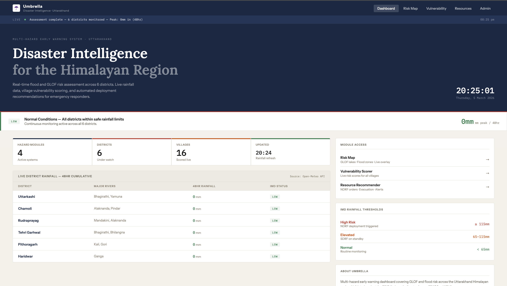
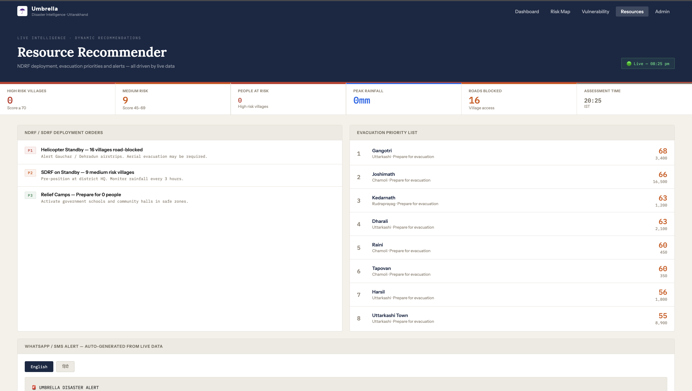

# ☂ UMBRELLA
### Multi-Hazard Early Warning & Response Dashboard
**Uttarakhand Disaster Intelligence System**

---

## 🌐 Live Links

| | URL |
|---|---|
| **🖥 Live Dashboard** | [umbrella-dashboard.netlify.app](https://umbrella-dashboard.netlify.app) |
| **🗺 Risk Map** | [umbrella-dashboard.netlify.app/map.html](https://umbrella-dashboard.netlify.app/map.html) |
| **🏘 Vulnerability Scorer** | [umbrella-dashboard.netlify.app/vulnerability.html](https://umbrella-dashboard.netlify.app/vulnerability.html) |
| **⚡ Resource Recommender** | [umbrella-dashboard.netlify.app/resources.html](https://umbrella-dashboard.netlify.app/resources.html) |
| **⚙ Admin Panel** | [umbrella-dashboard.netlify.app/admin.html](https://umbrella-dashboard.netlify.app/admin.html) |
| **🔌 Backend API** | [web-production-517aa.up.railway.app](https://web-production-517aa.up.railway.app) |
| **📡 Rainfall API** | [web-production-517aa.up.railway.app/rainfall](https://web-production-517aa.up.railway.app/rainfall) |
| **📊 Villages API** | [web-production-517aa.up.railway.app/villages](https://web-production-517aa.up.railway.app/villages) |

---

## Dashboard Preview

### Main Dashboard


### Risk Map


### Vulnerability Scorer


### Resource Recommender


---

## The Problem

In June 2013, over 6,000 people died in the Kedarnath disaster. In February 2021, a glacial lake outburst in Chamoli's Tapovan killed 200 more. Both events shared a critical failure — **ground-level intelligence arrived too late.**

Weather alerts exist. What doesn't exist is a tool that tells a District Magistrate at 11pm: *which villages are at risk right now, which roads are still open, how many minutes until the flood front arrives, and exactly which NDRF teams to deploy where.*

Umbrella fills that gap.

---

## What Umbrella Does

A four-screen disaster intelligence platform built for district-level emergency response in the Indian Himalayan Region.
### Live Incident Log *(In Development)*
- Real-time timestamped notes during active disasters
- Override automated recommendations with ground truth
- Running decision log for accountability and post-disaster review
- Exportable as official incident report

### Live Hazard Risk Map
- 8 real glacial lake markers with GLOF travel times to nearest villages
- Live flood risk zones for 6 districts — updated on every page load
- Real 48hr cumulative rainfall from Open-Meteo API
- IMD threshold classification: ≥115mm HIGH · 65–115mm MEDIUM · <65mm LOW

### Village Vulnerability Scorer
- 15 real Uttarakhand villages scored using a weighted formula
- Scores driven by **live rainfall data** — not hardcoded values
- Five factors: Population · GLOF Travel Time · Live Rainfall · Road Safety · Historical Event
- Filter by risk level, threat type, district

### Resource Recommender
- NDRF, SDRF, helicopter and hospital status tracking
- District-level action checklists with P1/P2/P3 priority
- WhatsApp alert generator in English and Hindi
- One-click PDF situation report export

### Admin Panel
- Add or remove villages directly from browser
- Data saved to SQLite database — no code changes needed

---

## Architecture

```
Browser (HTML · CSS · JavaScript)
         ↕  JSON over HTTP
Flask API Server — Railway
         ↕                    ↕
SQLite Database          Open-Meteo API
(village data)           (live rainfall)
```

**Frontend:** HTML5 · CSS3 · JavaScript · Leaflet.js — hosted on Netlify  
**Backend:** Python · Flask · Flask-CORS — hosted on Railway  
**Database:** SQLite  
**Data Sources:** Open-Meteo API (rainfall) · ISRO/ICIMOD coordinates (glacial lakes)

---

## Hazard Coverage

| Module | Status | Data Source |
|--------|--------|-------------|
| GLOF (Glacial Lake Outburst) | ✅ Live | ISRO NRSC coordinates |
| Monsoon Flooding | ✅ Live | Open-Meteo API |
| Avalanche | 🔄 Planned | SRTM DEM + IMD snowpack |
| Cyclone | 🔄 Planned | INCOIS storm surge data |

---

## Districts Monitored

Uttarkashi · Chamoli · Rudraprayag · Tehri Garhwal · Pithoragarh · Haridwar

---

## Running Locally

### Prerequisites
- Python 3.8+
- pip

### Setup

```bash
# Clone the repository
git clone https://github.com/AnubhavPadiyar/umbrella.git
cd umbrella

# Install dependencies
pip install flask flask-cors certifi

# Set up the database
python3 setup_db.py

# Start the backend server
python3 server.py
```

Server runs at `http://localhost:5001`

Open `index.html` in your browser.

---

## Vulnerability Scoring Formula

Each village is scored 0–100 across five weighted factors:

| Factor | Weight | Scoring |
|--------|--------|---------|
| Population | 25% | >10k=25pts · >5k=20pts · >1k=15pts |
| GLOF Travel Time | 20% | <20min=20pts · <40=15pts · <60=10pts |
| Live Rainfall Risk | 20% | HIGH=20pts · MEDIUM=12pts · LOW=4pts |
| Road Safety | 20% | Blocked=20pts · Safe=0pts |
| Historical Event | 15% | Yes=15pts · No=0pts |

**Risk Classification:** ≥70 = HIGH · 45–69 = MEDIUM · <45 = LOW

## Formula Validation — Kedarnath 2013

To test whether Umbrella's scoring formula is scientifically grounded, it was backtested against the June 2013 Kedarnath disaster — the most severe Himalayan disaster in recent history.

**Event:** Kedarnath Flash Flood & GLOF — June 16–17, 2013  
**Rainfall:** ~340mm in 24 hours — Rudraprayag district  
**Deaths:** 6,000+  
**Cause:** Chorabari glacial lake outburst + extreme monsoon rainfall

### Backtest Inputs

| Factor | 2013 Conditions | Score |
|--------|----------------|-------|
| Population | 1,200 permanent residents | 15pts |
| GLOF Travel Time | 23 minutes from Chorabari Lake | 15pts |
| Rainfall Risk | 340mm — HIGH (≥115mm threshold) | 20pts |
| Road Safety | All roads blocked | 20pts |
| Historical Event | Yes — prior flood history | 15pts |
| **Total Score** | | **85 / 100** |

**Umbrella Classification: HIGH RISK ✅**

### Result

Umbrella's formula correctly classifies Kedarnath as HIGH RISK under June 2013 conditions. The 85/100 score would have triggered P1 NDRF deployment recommendations and placed Kedarnath at the top of the evacuation priority list.

### Known Limitation

The formula uses permanent population (1,200) rather than peak season population. During Char Dham pilgrimage season (May–June), Kedarnath hosts 40,000–50,000 pilgrims — making the actual population at risk 40x higher than the permanent figure. A seasonal population multiplier is planned for a future version.

### Conclusion

The weighted formula performs correctly against historical data. The primary gap identified is seasonal population data for pilgrimage towns — a known limitation documented in the roadmap.

---

## Roadmap

- [ ] Real Census village coordinates (Datameet/Bhuvan)
- [ ] ISRO glacial lake inventory integration
- [ ] CWC river gauge data for flood forecasting
- [ ] Avalanche risk module (DEM + snowpack)
- [ ] SMS alert gateway
- [ ] Mobile responsive design
- [ ] Himachal Pradesh and Sikkim expansion
- [ ] Live Incident Log — real-time decision logging with timestamps during active disasters, override recommendations, exportable as incident report

---

## Why This Matters

The Himalayan region faces an accelerating disaster risk driven by:
- Glacial melt expanding lake volumes (GLOF frequency up 3x since 2000)
- Intensifying monsoon rainfall patterns
- Rapid infrastructure development in high-risk zones
- Growing pilgrimage and tourism populations in vulnerable valleys

Existing tools give weather data. Umbrella gives **ground intelligence** — connecting weather signals to village-level vulnerability, road conditions, and response resources.

---

## Built By

**Anubhav Padiyar** — Sophomore,Computer Science and Engineering

GitHub: [github.com/AnubhavPadiyar](https://github.com/AnubhavPadiyar)

---

